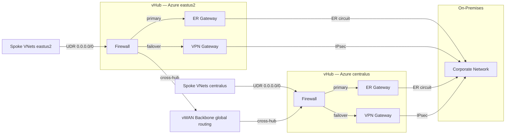
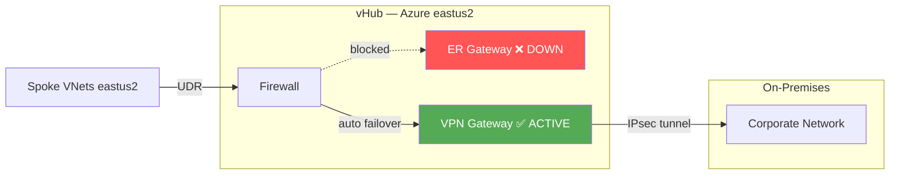
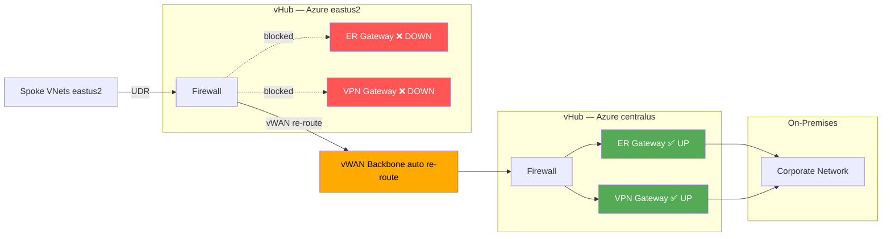
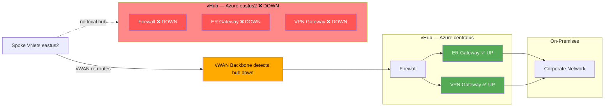

# Azure Landing Zone — Azure Verified Modules

Production-ready Azure Landing Zone built exclusively on **[Azure Verified Modules (AVM)](https://azure.github.io/Azure-Verified-Modules/)** — Microsoft's next-generation, officially supported Terraform module ecosystem. This implementation is functionally equivalent to the CAF Enterprise Scale landing zone but replaces the deprecated monolithic CAF module with individually versioned, composable AVM pattern and resource modules.

> **Why AVM?** The `terraform-azurerm-caf-enterprise-scale` module enters extended support (bug fixes only) and will be archived on **August 1, 2026**. AVM is the official replacement, actively developed, and aligned to the latest ALZ architecture and Azure API surface.

---

## Repository Structure

```
azure-landing-zone-verified-modules/
├── terraform.tf                          # Provider requirements (azurerm ~>4, azapi ~>2.4, alz ~>0.20, azuread ~>2.47)
├── providers.tf                          # Provider aliases: default, connectivity, management, identity, azapi, alz
├── variables.tf                          # All input variables with descriptions and validation
├── locals.tf                             # MG ID map, default tags, policy overrides, subscription placement
├── main.tf                               # avm-ptn-alz (MG hierarchy + policies) + AMBA baseline alerts
├── management.tf                         # avm-ptn-alz-management (Log Analytics, Automation, Defender)
├── connectivity.tf                       # avm-ptn-alz-connectivity-virtual-wan (Virtual WAN, Secured vHub, Firewall, DNS, Gateways)
├── identity.tf                           # Identity VNet, Azure Bastion (avm-res modules)
├── firewall_rules.tf                     # azurerm_firewall_policy_rule_collection_group — app/network/DNAT rules
├── custom_roles.tf                       # Four ALZ custom RBAC role definitions
├── custom_policies.tf                    # Custom policy definitions + assignments (e.g. Deny NAT Gateway on landing zones)
├── tls_inspection.tf                     # Key Vault, self-signed intermediate CA, managed identity for Firewall TLS inspection
├── rbac.tf                               # Entra ID groups + active and PIM-eligible role assignments
├── subscriptions.tf                      # lz-vending module (for_each over application_subscriptions map)
├── outputs.tf                            # Key output values consumed by landing-zone-vending module
├── post_deployment.tf                    # PIM policies, Sentinel connectors, break-glass accounts + alerts
├── terraform.tfvars                      # Deployment values (gitignored)
├── .gitignore
├── lib/
│   └── alz.alz_architecture_definition.json  # Custom MG hierarchy (my-* prefix) read by azure/alz provider
└── modules/
    └── landing-zone-vending/             # Reusable module for onboarding application subscriptions
        ├── main.tf                       # Entra groups, RBAC, spoke VNet, NSGs, UDRs, budget, diagnostics
        ├── variables.tf
        └── outputs.tf
```

---

## Azure Verified Modules Used

All modules are sourced directly from the [Terraform Registry](https://registry.terraform.io) — no local paths or Git references required.

### Pattern Modules (`avm-ptn-*`)

Pattern modules orchestrate multiple resources to deliver a complete capability.

| Module | Version | File | Purpose |
|---|---|---|---|
| `Azure/avm-ptn-alz/azurerm` | `~> 0.19` | `main.tf` | Management group hierarchy, ALZ policy library, role definitions |
| `Azure/avm-ptn-alz-management/azurerm` | `~> 0.9` | `management.tf` | Log Analytics workspace, Automation Account, AMA identity, DCRs, solutions |
| `Azure/avm-ptn-alz-connectivity-virtual-wan/azurerm` | `~> 0.14` | `connectivity.tf` | Virtual WAN, Secured vHub per region, Azure Firewall Premium (TLS inspection, IDPS), VPN/ER Gateways, DNS Private Resolver in sidecar VNet, Private DNS zones — cross-region routing platform-managed |
| `Azure/avm-ptn-monitoring-amba-alz/azurerm` | `~> 0.3` | `main.tf` | Azure Monitor Baseline Alerts (AMBA) — resource health, VM, network, security |
| `Azure/lz-vending/azurerm` | `~> 7.0` | `subscriptions.tf` | Subscription creation via EA/MCA billing API + MG association |

### Resource Modules (`avm-res-*`)

Resource modules manage individual Azure resource types with AVM standards.

| Module | Version | File | Purpose |
|---|---|---|---|
| `Azure/avm-res-resources-resourcegroup/azurerm` | `~> 0.2` | `identity.tf`, vending | Resource groups |
| `Azure/avm-res-network-virtualnetwork/azurerm` | `~> 0.17` | `identity.tf`, vending | Virtual networks, subnets, peerings, DNS |
| `Azure/avm-res-network-bastionhost/azurerm` | `~> 0.9` | `identity.tf` | Azure Bastion Standard (tunneling, file copy, IP connect) |
| `Azure/avm-res-network-publicipaddress/azurerm` | `~> 0.2` | `identity.tf` | Public IPs (zone-redundant) |
| `Azure/avm-res-network-networksecuritygroup/azurerm` | `~> 0.5` | vending | Network Security Groups with rules |
| `Azure/avm-res-network-ddosprotectionplan/azurerm` | `~> 0.3` | `connectivity.tf` (internal to connectivity module) | DDoS Protection Standard plan (optional) |

---

## Provider Requirements

| Provider | Version | Purpose |
|---|---|---|
| `hashicorp/azurerm` | `~> 4.0` | Azure resource management (AVM modules require v4.x — **not compatible with 3.x**) |
| `Azure/azapi` | `~> 2.4` | Direct Azure REST API access — used by `avm-ptn-alz` and connectivity module for operations not yet in azurerm |
| `Azure/alz` | `~> 0.20` | **New in AVM.** Manages the ALZ policy library and architecture definitions. Reads `lib/alz.alz_architecture_definition.json` and the upstream `platform/alz` library to build the MG hierarchy and policy assignments |
| `hashicorp/azuread` | `~> 2.47` | Entra ID groups, PIM assignments |
| `hashicorp/time` | `~> 0.11` | Propagation delays after MG/policy creation |

> **Terraform version:** AVM modules require **>= 1.12**. Install via `tfenv install 1.14.8 && tfenv use 1.14.8`.

> **Why the `alz` provider?** The `avm-ptn-alz` module delegates all ALZ library management to the `azure/alz` provider. This provider downloads and processes the ALZ policy library (architecture definitions, policy definitions, archetypes) independently of the Terraform provider release cycle, meaning policy updates don't require a module version bump.

### Provider Aliases

| Alias | Subscription | Used by |
|---|---|---|
| `azurerm` (default) | Management | MG hierarchy, policies, root-level RBAC, custom roles |
| `azurerm.connectivity` | Connectivity | Hub VNet, Firewall, DNS resolver, Private DNS zones, Gateways |
| `azurerm.management` | Management | Log Analytics, Automation, Defender plans, AMBA |
| `azurerm.identity` | Identity | Identity VNet, Bastion |
| `azapi` (default) | — (tenant-level) | `avm-ptn-alz` MG and policy operations |
| `alz` | — (reads library files) | `avm-ptn-alz` architecture + policy library |

---

## Management Group Hierarchy

### Pre-existing (must exist before `terraform apply`)

| Management Group | Notes |
|---|---|
| `Tenant Root Group` | Auto-exists in every Azure AD tenant. Terraform identity needs Owner + MG Contributor here. |

### Created by Terraform (`module.alz`)

All MGs below are created by `module.alz` (`avm-ptn-alz`). The `root_id` variable (default: `"corp"`) is used as a prefix for all names.

```
Tenant Root Group                              (pre-existing)
└── corp                                         L1 — Intermediate Root MG
    ├── corp-platform                            L2 — Platform subscriptions
    │   ├── corp-management                      L3 — Observability & security tooling
    │   ├── corp-connectivity                    L3 — Networking hub (vWAN, Firewall, DNS)
    │   └── corp-identity                        L3 — Identity services (AD DS, Bastion)
    ├── corp-landingzones                        L2 — Application workload subscriptions
    │   ├── corp-corp                            L3 — Private / internal workloads (no public endpoints)
    │   └── corp-online                          L3 — Internet-facing workloads (public endpoints allowed)
    ├── corp-sandboxes                           L2 — Developer experimentation (relaxed policies)
    └── corp-decommissioned                      L2 — Cancelled subscriptions awaiting cleanup
```

#### Purpose of each Management Group

| MG | Purpose | Key policies applied |
|---|---|---|
| `corp` (Root) | Intermediate root — all platform and workload MGs inherit from here. Scope for org-wide policies. | Deny resources outside allowed regions, deny classic resources, deny unmanaged disks |
| `corp-platform` | Groups all platform subscriptions. Separates platform ops from workload teams. | Inherits root policies |
| `corp-management` | Hosts the Management subscription: Log Analytics, Sentinel, Defender, AMBA alerts. Security team has read access here. | Inherits root + platform policies |
| `corp-connectivity` | Hosts the Connectivity subscription: vWAN, Firewall, DNS, Gateways. Network team manages here. | Inherits root + platform policies; deny unauthorised gateways in child MGs |
| `corp-identity` | Hosts the Identity subscription: AD DS VMs, Bastion. Isolated from workloads. | Deny public IPs, deny RDP/SSH from internet |
| `corp-landingzones` | Parent of all application workload MGs. Enforces workload baseline guardrails. | Deny IP forwarding, deny subnets without NSG, deny RDP/SSH from internet, deny storage HTTP, enforce TLS |
| `corp-corp` | Private workloads — no direct internet exposure. Internal apps, databases, APIs. | Deny public IPs on NICs, deny public PaaS endpoints, deny Databricks without VNet injection, deny NAT Gateway |
| `corp-online` | Internet-facing workloads — public endpoints permitted under controlled conditions. | Deny NAT Gateway (egress must go through Firewall) |
| `corp-sandboxes` | Developer sandboxes — less restrictive, isolated from production. | Deny NAT Gateway; some production policies relaxed |
| `corp-decommissioned` | Landing zone for cancelled subscriptions. Prevents accidental resource creation. | Deny all resource creation |

### ALZ Policy Library and Architecture Definition

The `avm-ptn-alz` module uses the `azure/alz` provider (configured in `providers.tf`) to manage the policy library and architecture:

```hcl
provider "alz" {
  library_overwrite_enabled = true
  library_references = [
    { path = "platform/alz", ref = "2026.01.3" },  # upstream ALZ policies
    { custom_url = "${path.root}/lib" },             # our custom architecture definition
  ]
}
```

The `lib/alz.alz_architecture_definition.json` file defines the custom MG hierarchy with the `my-*` prefix. The `library_overwrite_enabled = true` flag allows it to override the built-in `alz` architecture. Update `ref` to pick up new policy definitions without changing module versions. See [Azure-Landing-Zones-Library releases](https://github.com/Azure/Azure-Landing-Zones-Library/releases).

---

## Platform Subscriptions

Three subscriptions must be pre-created before `terraform apply`. Each is associated to its management group by the `avm-ptn-alz` module.

| Variable | Management Group | Key Resources Deployed |
|---|---|---|
| `subscription_id_management` | `corp-management` | Log Analytics workspace, Automation Account, Microsoft Sentinel, Defender for Cloud, AMBA alerts |
| `subscription_id_connectivity` | `corp-connectivity` | Hub VNet, Azure Firewall Premium, VPN Gateway (VpnGw2AZ), DNS Private Resolver, ~40 Private DNS zones |
| `subscription_id_identity` | `corp-identity` | Identity VNet (10.2.0.0/24), Azure Bastion Standard, AD DS subnet |

---

## Resources Created

### `main.tf` — Core ALZ + AMBA

#### `module.alz` (`avm-ptn-alz`)

| Resource Type | What it creates |
|---|---|
| `azurerm_management_group` | 10 management groups across 4 levels |
| `azurerm_management_group_subscription_association` | Platform and pre-existing application subscription placements |
| `azurerm_policy_definition` | ~100+ custom ALZ policy definitions registered at root MG |
| `azurerm_policy_set_definition` | ~20+ policy initiative definitions |
| `azurerm_management_group_policy_assignment` | Policy assignments per MG archetype |
| `azurerm_role_definition` | Built-in ALZ custom roles: `Application-Owners`, `Network-Management`, `Security-Operations`, `Subscription-Owner`, `Network-Subnet-Contributor` |
| `azurerm_role_assignment` | Role assignments for DINE policy managed identities |

#### `module.amba` (`avm-ptn-monitoring-amba-alz`)

| Resource | Description |
|---|---|
| `azurerm_resource_group` | `rg-amba-<location>-001` in Management subscription |
| `azurerm_user_assigned_identity` | `id-amba-<location>-001` — used by AMBA alert processing rules |
| Policy assignments | Azure Monitor Baseline Alerts scoped at Root MG (resource health, VM, network, security, connectivity) |

---

### `management.tf` — Management Platform

#### `module.management` (`avm-ptn-alz-management`)

Uses flat variable names (not nested objects). Key variables: `log_analytics_workspace_name`, `automation_account_name`, `log_analytics_solution_plans` (list), `sentinel_onboarding` (object), `user_assigned_managed_identities` (map), `data_collection_rules` (map).

| Resource | Name | Description |
|---|---|---|
| `azurerm_resource_group` | `rg-management-<location>-001` | Management subscription resource group |
| `azurerm_log_analytics_workspace` | `log-management-<location>-001` | Central log sink — all subscriptions stream here |
| `azurerm_automation_account` | `aa-management-<location>-001` | Linked to workspace; Update Management, DSC |
| `azurerm_user_assigned_identity` | `id-ama-management-<location>-001` | Azure Monitor Agent identity for DINE policies |
| `azurerm_log_analytics_solution` × 7 | — | VMInsights, ContainerInsights, ChangeTracking, Updates, SQLAssessment, AntiMalware, AgentHealth |
| `azurerm_log_analytics_solution` (Sentinel) | — | Deployed via `sentinel_onboarding` object |
| `azapi_resource` (DCR) × 3 | `dcr-{change-tracking,defender-sql,vm-insights}-<location>-001` | Data Collection Rules for AMA |

#### Defender for Cloud (`management.tf`)

| Resource | Description |
|---|---|
| `azurerm_security_center_contact` | Security contact email for Defender alerts |
| `azurerm_security_center_subscription_pricing` × 13 | Enables Defender plans: AppServices, Arm, Containers, CosmosDbs, Dns, KeyVaults, KubernetesService, OpenSourceRelationalDatabases, SqlServerVirtualMachines, SqlServers, StorageAccounts, VirtualMachines, Api |

---

### `connectivity.tf` — Virtual WAN Networking

One `azurerm_resource_group` per region, then `module.connectivity` (`avm-ptn-alz-connectivity-virtual-wan`) is called with a single `virtual_hubs` map. The module manages all hub resources internally.

#### `azurerm_resource_group.connectivity` (one per region)

| Resource | Name |
|---|---|
| `azurerm_resource_group` | `rg-connectivity-<location>-001` |

#### `module.connectivity` (`avm-ptn-alz-connectivity-virtual-wan`) — internal resources per hub

| Resource | Description | Controlled by |
|---|---|---|
| `azurerm_virtual_wan` | Single vWAN instance (shared across all hubs) | `virtual_wan_settings` |
| `azurerm_virtual_hub` | One vHub per region | `virtual_hubs.<key>.location` |
| `azurerm_firewall_policy` | Auto-named, Premium SKU — TLS inspection, IDPS, URL filtering | `enabled_resources.firewall = true` |
| `azurerm_firewall` | Auto-named, Premium SKU (`AZFW_Hub`), Secured vHub | `firewall.sku_tier = "Premium"` |
| `azurerm_express_route_gateway` | ER Gateway in vHub | `enabled_resources.virtual_network_gateway_express_route = true` |
| `azurerm_vpn_gateway` | VPN Gateway in vHub (ER failover) | `enabled_resources.virtual_network_gateway_vpn = true` |
| `azurerm_virtual_network` | DNS sidecar VNet (auto-peered to vHub) | `sidecar_virtual_network` block |
| `azurerm_private_dns_resolver` | DNS Resolver in sidecar VNet | `enabled_resources.private_dns_resolver = true` |
| `azurerm_private_dns_resolver_inbound_endpoint` | Inbound endpoint in sidecar VNet | Internal |
| `azurerm_private_dns_zone` × ~40 | Private Link zones | `enabled_resources.private_dns_zones = true` |
| `azurerm_network_ddos_protection_plan` | Optional, shared | `virtual_wan_settings.enabled_resources.ddos_protection_plan` |

> **Premium SKU** (`AZFW_Hub`) is deployed. TLS inspection, IDPS, and URL filtering are all available. TLS inspection is conditionally enabled via `firewall_tls_inspection_enabled` — see the TLS Inspection section under Networking for prerequisites.

> The module uses default naming conventions based on location and sequence number. Override via `default_naming_convention` in `virtual_wan_settings` if exact names are required.

#### DNS server IP for spoke VNets

```hcl
module.connectivity.dns_server_ip_address["primary"]
```

Exposed as the `dns_resolver_inbound_ip` output. Set this as the DNS server on all spoke VNets so Private DNS zones resolve correctly.

---

### `identity.tf` — Identity Platform

| Resource | Name | Description |
|---|---|---|
| `azurerm_resource_group` | `rg-identity-<location>-001` | Identity subscription resource group |
| `azurerm_virtual_network` | `vnet-identity-<location>-001` (`10.2.0.0/24`) | Identity spoke VNet |
| `azurerm_subnet` | `snet-adds` (`10.2.0.0/27`) | Active Directory Domain Services VMs |
| `azurerm_subnet` | `AzureBastionSubnet` (`10.2.0.32/27`) | Azure Bastion |
| `azurerm_virtual_network_peering` | `peer-identity-to-hub` | Identity → Hub (spoke side) |
| `azurerm_virtual_network_peering` | `peer-hub-to-identity` | Hub → Identity (hub side, reverse peering via `create_reverse_peering`) |
| `azurerm_public_ip` | `pip-bastion-identity-001` | Static Standard, zone-redundant zones 1/2/3 |
| `azurerm_bastion_host` | `bas-identity-<location>-001` | Bastion Standard: tunneling, file copy, IP connect |

---

### `custom_roles.tf` — Custom RBAC Roles

All four roles are scoped to the Root MG and inherited everywhere. They complement the built-in ALZ roles created by `module.alz`.

| Role | Assignable to | Key `NotActions` |
|---|---|---|
| `ALZ-Application-Owner` | Application team members | No RBAC write, no VNet/Firewall/public IP/route table changes |
| `ALZ-Network-Operations` | Network team | No RBAC write |
| `ALZ-Security-Operations` | Security team | No infrastructure create/delete |
| `ALZ-Subscription-Owner` | Workload team leads (per sub) | No Owner/UAA grants to others, no shared network changes |

---

### `rbac.tf` — Entra ID Groups

#### Groups Created

| Group | Purpose |
|---|---|
| `grp-platform-admins` | Senior platform engineers — PIM-eligible Owner on Platform MG |
| `grp-security-ops` | Security Operations team |
| `grp-network-ops` | Network Operations team |
| `grp-finops` | FinOps / Cost Management |
| `grp-platform-readers` | All platform staff — read visibility across everything |
| `grp-identity-admins` | Identity platform engineers |
| `grp-connectivity-admins` | Network platform engineers |
| `grp-management-admins` | Observability platform engineers |

#### Active Role Assignments

| Principal | Role | Scope |
|---|---|---|
| `grp-security-ops` | `ALZ-Security-Operations` | Root MG |
| `grp-network-ops` | `ALZ-Network-Operations` | Root MG |
| `grp-finops` | Billing Reader | Root MG |
| `grp-finops` | Cost Management Reader | Root MG |
| `grp-platform-readers` | Reader | Root MG |
| `grp-identity-admins` | Contributor | Identity subscription |
| `grp-identity-admins` | User Access Administrator (condition-scoped, no Owner grants) | Identity subscription |

#### PIM Eligible Role Assignments

Just-in-time — activated in Azure Portal or CLI with MFA + justification.

| Principal | Role | Scope |
|---|---|---|
| `grp-platform-admins` | Owner | Platform MG |
| `grp-connectivity-admins` | Contributor | Connectivity subscription |
| `grp-management-admins` | Contributor | Management subscription |

---

### `subscriptions.tf` — Subscription Vending (`lz-vending`)

For each entry in `application_subscriptions`, `module.lz_vending` creates:

| Resource | Description |
|---|---|
| `azurerm_subscription` | New Azure subscription via EA/MCA billing API (`subscription_alias_enabled = true`) |
| `azurerm_management_group_subscription_association` | Places subscription under target MG (corp/online/sandboxes) |

Subscriptions tagged with `Workload`, `Environment`, `CostCenter`, `Owner`. `Production` workload type for `prod`; `DevTest` for all others. The `location` variable (required by `lz-vending ~> 7.0`) is set to `var.default_location`.

> **Note:** `lifecycle { prevent_destroy = true }` is **not supported** in `module` blocks (only in `resource` blocks). To protect against accidental subscription cancellation, restrict `terraform destroy` permissions via CI/CD pipeline IAM or use a separate state workspace for subscriptions.

---

### `modules/landing-zone-vending/` — Spoke Onboarding Module

Called separately per workload. Everything is created in the target workload subscription.

| Resource | Name Pattern | Description |
|---|---|---|
| `azuread_group` × 3 | `grp-<workload>-<env>-{admins,devs,readers}` | Entra ID security groups |
| `azurerm_role_assignment` × 3 | — | ALZ-Subscription-Owner, ALZ-Application-Owner, Reader on subscription |
| `azurerm_resource_group` | `rg-network-<workload>-<env>-001` | Spoke network resource group |
| `azurerm_virtual_network` | `vnet-<workload>-<env>-001` | Spoke VNet — DNS server set to Private Resolver inbound IP |
| `azurerm_subnet` | `snet-app-<workload>-<env>-001` | Application servers |
| `azurerm_subnet` | `snet-data-<workload>-<env>-001` | Databases / data tier |
| `azurerm_subnet` | `snet-pep-<workload>-<env>-001` | Private Endpoints only (private endpoint network policies disabled) |
| `azurerm_subnet` | `snet-mgmt-<workload>-<env>-001` | Jump boxes / management tooling |
| `azurerm_network_security_group` × 3 | `nsg-{app,data,pep}-<workload>-<env>-001` | NSGs: deny Internet inbound on app/pep; data allows only app subnet on DB ports |
| `azurerm_route_table` | `rt-<workload>-<env>-001` | UDR: `0.0.0.0/0 → Firewall private IP` (when firewall IP provided) |
| `azurerm_virtual_network_peering` | `peer-<workload>-<env>-to-hub` | Spoke → Hub peering (spoke side) |
| `azurerm_consumption_budget_subscription` | `budget-<workload>-<env>` | Monthly budget — 80% warning + 100% critical email alert |
| `azurerm_monitor_diagnostic_setting` | `diag-<workload>-<env>-vnet` | Spoke VNet metrics → central Log Analytics workspace |

---

## Policy Governance

Policy is managed by the ALZ library referenced in the `alz` provider (`providers.tf`). Customisations are applied via `policy_assignments_to_modify` in `locals.tf`.

The variable uses a **nested map structure** — outer key is the MG name, inner key is the policy assignment name. Each parameter value must include a `"value"` wrapper:

```hcl
policy_assignments_to_modify = {
  "corp" = {                              # management group name
    policy_assignments = {
      "Deny-Resource-Locations" = {     # policy assignment name
        parameters = {
          listOfAllowedLocations = jsonencode({ value = ["eastus2", "centralus", "global"] })
        }
      }
    }
  }
}
```

### Overrides configured in this repo

| MG | Policy Assignment | Override | Effect |
|---|---|---|---|
| `corp` (Root) | `Deny-Resource-Locations` | `listOfAllowedLocations = [eastus2, centralus, global]` | **Deny** resources outside approved regions |
| `corp` (Root) | `Deny-RSG-Locations` | `listOfAllowedLocations = [eastus2, centralus]` | **Deny** RGs outside approved regions |
| `corp-corp` | `Deny-Databricks-NoPublicIp` | `enforcement_mode = "Default"` | **Deny** Databricks with public IPs on cluster nodes |
| `corp-corp` | `Deny-Databricks-Sku` | `enforcement_mode = "Default"` | **Deny** non-Premium Databricks tier |
| `corp-corp` | `Deny-Databricks-VirtualNetwork` | `enforcement_mode = "Default"` | **Deny** Databricks without VNet injection |

### Hard Deny policies (selected — full list in ALZ library)

| Management Group | Policy | What it blocks |
|---|---|---|
| Root | `Deny-Classic-Resources` | Any Azure classic (v1) resource |
| Root | `Deny-UnmanagedDisk` | VMs without managed disks |
| Root | `Deny-Resource-Locations` | Resources outside allowed regions |
| Root | `Deny-RSG-Locations` | Resource groups outside allowed regions |
| Landing Zones | `Deny-IP-forwarding` | NICs with IP forwarding |
| Landing Zones | `Deny-MgmtPorts-Internet` | NSG rules opening RDP/SSH from Internet |
| Landing Zones | `Deny-Subnet-Without-Nsg` | Subnets without NSG |
| Landing Zones | `Deny-Storage-http` | Storage without HTTPS-only |
| Landing Zones | `Enforce-TLS-SSL-Q225` | HTTP endpoints on App Services, Redis, SQL, etc. |
| Corp | `Deny-Public-IP-On-NIC` | Public IPs on NICs |
| Corp | `Deny-Public-Endpoints` | Public PaaS endpoints |
| Corp | `Deny-HybridNetworking` | Unauthorised VPN/ER gateways |
| Corp | `Deny-Databricks-NoPublicIp` | Databricks with public cluster IPs |
| Corp | `Deny-Databricks-Sku` | Non-Premium Databricks |
| Corp | `Deny-Databricks-VirtualNetwork` | Databricks not injected into VNet |
| Identity | `Deny-Public-IP` | Any public IP in Identity subscription |
| Identity | `Deny-MgmtPorts-Internet` | RDP/SSH from Internet |

### DeployIfNotExists policies (auto-remediate, never block)

`Deploy-MDFC-Config`, `Deploy-MDEndpoints`, `Deploy-AzActivity-Log`, `Deploy-Diag-LogsCat`, `Deploy-VM-Monitoring`, `Deploy-VMSS-Monitoring`, `Deploy-VM-ChangeTrack`, `Deploy-VM-Backup`, `Deploy-AzSqlDb-Auditing`, `Deploy-SQL-TDE`, `Deploy-SQL-Threat`, `Deploy-Private-DNS-Zones`, and more.

---

## Centralised Logging

All logs converge to `log-management-<location>-001` in the Management subscription.

| Log source | Mechanism |
|---|---|
| Azure control-plane (who did what) | `Deploy-AzActivity-Log` DINE policy — Activity Log diagnostic settings on every subscription |
| Resource diagnostic logs (~60 types) | `Deploy-Diag-LogsCat` DINE policy — diagnostic settings on VMs, Key Vaults, SQL, AKS, Firewall, App Services, etc. |
| VM OS metrics, events, syslog | Azure Monitor Agent (AMA) — `Deploy-VM-Monitoring` DINE policy + VM Insights DCR |
| VM configuration changes | Change Tracking DCR via `Deploy-VM-ChangeTrack` |
| SQL telemetry | Defender for SQL DCR |
| NSG flow logs | `Deploy-Nsg-FlowLogs-to-LA` policy |
| Security alerts | Microsoft Defender for Cloud → workspace |
| Threat detection | Microsoft Sentinel — ingests all the above |

**Log Analytics solutions enabled:** Sentinel, VM Insights, Container Insights, Change Tracking, Updates (Azure Update Manager), SQL Assessment, Anti-Malware Assessment, Agent Health Assessment.

---

## Networking

### Virtual WAN — multi-region (`hub_networks`)

The vHub is a Microsoft-managed routing construct. There are no subnets to define inside it — the platform manages all internal addressing. The only CIDRs you supply are the hub routing prefix and the sidecar VNet for DNS.

| Component | CIDR (eastus2) | CIDR (centralus) | Notes |
|---|---|---|---|
| vHub routing prefix | `10.0.0.0/23` | `10.1.0.0/23` | Min /23; advertised to spokes and on-prem via BGP |
| DNS sidecar VNet | `10.0.2.0/25` | `10.1.2.0/25` | Auto-peered to vHub; hosts DNS Private Resolver |
| `dns-resolver-inbound` | `10.0.2.0/28` | `10.1.2.0/28` | Min /28 |
| `dns-resolver-outbound` | `10.0.2.16/28` | `10.1.2.16/28` | Min /28 |

Cross-region routing between hubs and to on-premises is handled automatically by the vWAN platform — no UDRs required on spokes.

### DNS Resolution

#### Private DNS zones (Azure PaaS services)

~40 Private Link DNS zones are deployed in the connectivity subscription and linked to the DNS sidecar VNet in each hub. All spoke VNets are configured with the DNS Private Resolver inbound endpoint IP as their custom DNS server. The resolution chain is:

```
Workload VM
  → DNS query to Resolver inbound IP (e.g. 10.0.2.4)
    → Azure DNS (168.63.129.16)
      → Private DNS zone (e.g. privatelink.blob.core.windows.net)
        → Private endpoint IP returned
```

The DNS Private Resolver inbound endpoint is always deployed — it is not conditional on `dns_forwarding_rules`. This ensures spoke VNets can resolve private DNS zones even when no on-premises forwarding is configured.

#### On-premises DNS forwarding

When `dns_forwarding_rules` is non-empty in `terraform.tfvars`, the resolver also deploys an **outbound endpoint** with a forwarding ruleset. Queries for on-premises domains (e.g. `corp.local.`) are forwarded to on-premises DNS servers via the outbound endpoint:

```
Workload VM
  → DNS query for corp.local to Resolver inbound IP
    → Forwarding ruleset matches corp.local.
      → Resolver outbound endpoint
        → On-premises DNS server (e.g. 192.168.1.10:53)
          → On-premises hostname resolved
```

Configure forwarding rules in `terraform.tfvars`:

```hcl
dns_forwarding_rules = {
  corp_local = {
    domain_name = "corp.local."          # trailing dot required
    dns_servers = ["192.168.1.10", "192.168.1.11"]
  }
}
```

Leave `dns_forwarding_rules = {}` to skip the outbound endpoint entirely — only Private Link DNS resolution is active.

#### Why a sidecar VNet is required

The vHub is Microsoft-managed — custom subnets cannot be placed inside it. The DNS Private Resolver requires dedicated `/28` subnets for its inbound and outbound endpoints. A separate sidecar VNet is provisioned alongside each hub and auto-connected to it via `azurerm_virtual_hub_connection`, making the resolver IP reachable from all spokes through the vHub routing fabric.

| Subnet | Purpose | Min size |
|---|---|---|
| `dns-resolver-inbound` | Receives queries from spoke VNets | /28 |
| `dns-resolver-outbound` | Forwards queries to on-premises DNS | /28 |

### Azure Firewall — TLS Inspection

Azure Firewall **Premium** is deployed (`sku_tier = "Premium"`) in all hubs. The Premium tier supports TLS inspection in a Secured vHub — the firewall terminates outbound and east-west TLS connections, decrypts and inspects traffic with IDPS, then re-encrypts before forwarding.

TLS inspection is **conditionally enabled** via `firewall_tls_inspection_enabled` in `terraform.tfvars`. It defaults to `false` until the prerequisite Key Vault and certificate are provisioned.

#### Enabling TLS inspection

Set one flag in `terraform.tfvars` — everything else is fully automated by `tls_inspection.tf`:

```hcl
firewall_tls_inspection_enabled = true
```

`terraform apply` will automatically provision:

| Resource | Name | Purpose |
|---|---|---|
| `azurerm_resource_group` | `rg-tls-inspection-<location>-001` | Container for TLS resources |
| `azurerm_user_assigned_identity` | `id-firewall-tls-<location>-001` | Identity the firewall uses to read the cert from Key Vault |
| `azurerm_key_vault` | `kv-fw-tls-<location>-001` | Stores the intermediate CA cert; Premium SKU, purge protection enabled |
| `azurerm_key_vault_certificate` | `firewall-intermediate-ca` | Self-signed intermediate CA (RSA 4096, 24 months, `CA:true`) |
| `azurerm_role_assignment` × 3 | — | Terraform: Cert + Secrets Officer; Firewall identity: Secrets User |

#### One manual step — distribute the root CA to workload VMs

Because this is a self-signed certificate, workload VMs will not automatically trust HTTPS connections re-signed by the firewall. After `terraform apply`, download the certificate from Key Vault and deploy it to all workload VMs as a trusted root CA:

```bash
# Download the certificate
az keyvault certificate download \
  --vault-name kv-fw-tls-eastus2-001 \
  --name firewall-intermediate-ca \
  --file firewall-intermediate-ca.cer

# Deploy to Linux VMs (via VM extension, Ansible, or cloud-init)
# Deploy to Windows VMs via GPO: Computer Configuration → Trusted Root CAs
```

#### What is and is not inspected

| Traffic | TLS inspected? | Notes |
|---|---|---|
| Spoke → internet (HTTPS) | Yes | Decrypted, IDPS-scanned, re-encrypted |
| Spoke → spoke (east-west HTTPS) | Yes | When `private_traffic_inspection_enabled = true` |
| On-premises traffic | No | BGP-propagated routes bypass the firewall |
| Private endpoints (`snet-pep-*`) | No | Subnet excluded from UDR by design |

### Routing Intent — Disabled (deliberate)

Routing Intent is **intentionally disabled** in `connectivity.tf`. Here is why:

When Routing Intent with `private_traffic_routing_policy` is enabled, vWAN advertises RFC 1918 summary prefixes across hubs instead of specific on-premises routes learned from ER/VPN. This prevents the centralus hub's on-premises routes from being visible in the eastus2 hub routing table, **breaking cross-region ER failover**.

Instead, firewall enforcement is achieved via explicit UDRs on every spoke subnet:

```
0.0.0.0/0 → Firewall private IP (VirtualAppliance)
```

With BGP route propagation **enabled** (`disable_bgp_route_propagation = false`) on spoke route tables, the vHub injects specific on-premises prefixes into spoke subnets. This means:
- Default internet traffic → Firewall (enforced by the UDR)
- On-premises specific prefixes → BGP-propagated routes from the vHub (enabling cross-region failover)

To re-enable Routing Intent (e.g. if cross-region failover is not a requirement), uncomment the `routing_intent` block in `connectivity.tf` and set `disable_bgp_route_propagation = true` in `modules/landing-zone-vending/main.tf`.

---

## On-Premises Connectivity — Traffic Flows and Failover

### Architecture Overview

Two Azure regions (eastus2, centralus) each run a vWAN Secured vHub with an ExpressRoute (ER) Gateway and a VPN Gateway. Both hubs connect to on-premises over independent ER circuits and IPsec VPN tunnels. The vWAN platform maintains a global routing table across both hubs — cross-region re-routing is automatic.

#### Text diagram — steady state (all paths up)

```
  On-Premises
  +-----------+
  | Corp Net  |<--------ER circuit (primary)----------+
  |           |<--------IPsec VPN (failover)----------+
  +-----------+<--------ER circuit (primary)----------+-----+
               <--------IPsec VPN (failover)----------+     |
                                                       |     |
  Azure Virtual WAN                                   |     |
  +-----------------------------+  +-----------------------------+
  |  eastus2 vHub               |  |  centralus vHub             |
  |                             |  |                             |
  |  Firewall (UDR 0.0.0.0/0)  |  |  Firewall (UDR 0.0.0.0/0)  |
  |  ER Gateway ----------------+--+  ER Gateway ----------------+
  |  VPN Gateway ---------------+--+  VPN Gateway ---------------+
  |  DNS Resolver (sidecar)     |  |  DNS Resolver (sidecar)     |
  +-----------------------------+  +-----------------------------+
          ^                                    ^
          | vWAN backbone (auto cross-hub)     |
          +------------------------------------+
          |                                    |
  +----------------+               +----------------+
  | Spokes eastus2 |               | Spokes centralus|
  | snet-app       |               | snet-app        |
  | snet-data      |               | snet-data       |
  | snet-mgmt      |               | snet-mgmt       |
  +----------------+               +----------------+

  Normal traffic path:
    eastus2 spoke --[UDR]--> eastus2 Firewall --> eastus2 ER Gateway --> ER circuit --> on-prem
    centralus spoke --[UDR]--> centralus Firewall --> centralus ER Gateway --> ER circuit --> on-prem
```

#### Text diagram — scenario 1: eastus2 ER down, VPN failover (within region)

```
  eastus2 spoke
       |
       v (UDR 0.0.0.0/0)
  eastus2 Firewall
       |
       +-- ER Gateway  --[DOWN]--X  ER circuit  --X  on-prem
       |
       +-- VPN Gateway --[AUTO]--->  IPsec tunnel --->  on-prem
                  BGP reconverges automatically; no manual action needed
```

#### Text diagram — scenario 2: eastus2 ER + VPN both down, cross-region via centralus

```
  eastus2 spoke
       |
       v (UDR 0.0.0.0/0)
  eastus2 Firewall
       |
       +-- ER Gateway  --[DOWN]--X
       |
       +-- VPN Gateway --[DOWN]--X
       |
       v  vWAN backbone detects both gateways down, re-routes automatically
  centralus vHub
       |
       +-- ER Gateway  ---> ER circuit  ---> on-prem
       |
       +-- VPN Gateway ---> IPsec tunnel ---> on-prem
```

#### Text diagram — scenario 3: entire eastus2 vHub down

```
  eastus2 spoke
       |
       v  eastus2 vHub is DOWN
       X  (local Firewall, ER, VPN all unavailable)
       |
       v  vWAN global routing detects hub unavailability, re-routes
  centralus vHub
       |
       +-- ER Gateway  ---> ER circuit  ---> on-prem
       |
       +-- VPN Gateway ---> IPsec tunnel ---> on-prem

  Note: eastus2 spokes lose local internet egress while vHub is down.
        On-prem connectivity is preserved via centralus gateways.
```

---

### Mermaid diagram — steady state (all paths up)



---

### Mermaid diagram — scenario 1: eastus2 ER down, VPN takes over



---

### Mermaid diagram — scenario 2: eastus2 ER + VPN both down, cross-region



---

### Mermaid diagram — scenario 3: entire eastus2 vHub down



---

### Failover matrix

| Failure scenario | Automatic failover | Path |
|---|---|---|
| eastus2 ER circuit down (provider/MSEE) | Yes — within region | eastus2 spoke → Firewall → VPN Gateway → on-prem |
| eastus2 Azure ER infrastructure outage | Yes — within region | eastus2 spoke → Firewall → VPN Gateway → on-prem |
| eastus2 ER + VPN both down | Yes — cross-region | eastus2 spoke → vWAN backbone → centralus Firewall → ER/VPN → on-prem |
| eastus2 entire vHub down | Yes — cross-region | eastus2 spokes → vWAN backbone → centralus vHub → ER/VPN → on-prem |
| Both regions’ ER + VPN down simultaneously | No | All spokes lose on-prem connectivity |

### Known limitation — Redundant ER circuits per region

Deploying two ER circuits per hub from different providers or peering locations covers provider and MSEE failures. However, it does **not** cover an Azure-side ER infrastructure outage in that region — both circuits terminate at the same Azure ER Gateway, so an Azure regional ER outage takes them both down. The VPN Gateway (and cross-region vWAN routing) remains the protection against Azure-side ER failures.

### Current posture summary

| Failure | On-prem connectivity preserved? |
|---|---|
| ER circuit / provider failure | Yes — VPN takes over automatically |
| Azure ER infrastructure outage in a region | Yes — VPN takes over, or cross-region via vWAN |
| Both ER and VPN down in a region | Yes — vWAN re-routes via the other region |
| Both regions’ gateways down simultaneously | No |

vWAN eliminates the single-region-failure gap that existed in the hub VNet architecture. The only scenario with no automatic recovery is a simultaneous failure of all gateways in all regions.

### Identity VNet — `10.2.0.0/24`

| Subnet | CIDR | Purpose |
|---|---|---|
| `snet-adds` | `10.2.0.0/27` | Active Directory Domain Services VMs |
| `AzureBastionSubnet` | `10.2.0.32/27` | Azure Bastion Standard |

### Spoke VNet template (landing-zone-vending module)

| Subnet | Default CIDR | Purpose |
|---|---|---|
| `snet-app-*` | `10.10.0.0/24` | Application servers |
| `snet-data-*` | `10.10.1.0/24` | Databases, data services |
| `snet-mgmt-*` | `10.10.2.0/27` | Jump boxes, management tooling |
| `snet-pep-*` | `10.10.2.32/27` | Private endpoint NICs only |

### Azure Firewall Premium

- Zone-redundant (zones 1/2/3)
- DNS proxy enabled (required for FQDN rules and Private DNS)
- Threat intelligence: `Alert` mode (change to `Deny` after validating allowlist)
- IDPS: `Alert` mode (change to `Deny` for active blocking)
- 4 public IPs per hub — dedicated IPs for DNAT targets, additional SNAT port capacity for high-volume egress

#### Traffic flow through Firewall

All spoke subnets (except `snet-pep-*`) have a UDR attached with a single default route:

```
0.0.0.0/0 → Firewall private IP (VirtualAppliance)
```

This means **every packet leaving a spoke subnet** — internet-bound or cross-spoke — hits the Firewall first. The Firewall then applies rules in priority order:

| Traffic type | Path | Controlled by |
|---|---|---|
| Internet egress (HTTPS) | Spoke → Firewall → FQDN application rules → internet | `firewall_application_rule_collections` |
| Internet egress (non-HTTP) | Spoke → Firewall → network rules → internet | `firewall_network_rule_collections` |
| Inbound from internet | Internet → Firewall public IP → DNAT rule → spoke private IP | `firewall_nat_rule_collections` |
| Cross-spoke (east-west) | Spoke A → Firewall → Firewall rules → Spoke B | Controlled by `private_traffic_inspection_enabled` |
| On-premises | Spoke → BGP-propagated specific routes → vHub ER/VPN (bypasses Firewall) | vHub routing table |
| Private endpoints | `snet-pep-*` has no UDR — traffic routes directly via vHub | Subnet excluded by design |

> **Private traffic inspection** is controlled by `private_traffic_inspection_enabled` in `terraform.tfvars`. When `true` (default), all RFC 1918 traffic flows through the Firewall for east-west inspection. When `false`, more-specific RFC 1918 routes (`private_bypass_address_prefixes`) are added to bypass the Firewall — internet egress always hits the Firewall regardless.

#### Why `snet-pep-*` is excluded from the UDR

Azure does not allow UDRs on subnets that contain private endpoints — the platform enforces direct routing to private endpoint NICs. DNS resolution via the Private Resolver inbound endpoint returns the private IP, so traffic reaches private endpoints without traversing the Firewall. NSG rules on `snet-pep-*` provide the security boundary instead.

---

### NAT Gateway — Denied by Policy

NAT Gateway is **explicitly prohibited** on all workload landing zones and sandbox subscriptions via a custom Azure Policy (`Deny-NatGateway-Deployment` in `custom_policies.tf`).

#### Why

NAT Gateway provides outbound internet egress independently of the hub Firewall. If a workload team deploys a NAT Gateway on their spoke subnet, outbound traffic would bypass the Firewall entirely — no FQDN filtering, no threat intelligence, no IDPS, no egress logs. This defeats the entire hub-and-spoke security model.

```
Without policy (dangerous):
  Spoke VM → NAT Gateway → internet   ← no inspection, no logging

With policy enforced (correct):
  Spoke VM → UDR → Firewall → internet   ← inspected, logged, FQDN-filtered
```

#### Policy scope

| Assignment | Scope | Covers |
|---|---|---|
| `Deny-NatGW-LZ` | `corp-landingzones` MG | All corp and online workload subscriptions |
| `Deny-NatGW-SBX` | `corp-sandboxes` MG | All sandbox subscriptions |

`corp-platform` (connectivity, management, identity) is intentionally excluded — the connectivity subscription owns the hub Firewall public IPs and may legitimately need NAT Gateway in edge cases.

#### What happens if a team tries to deploy a NAT Gateway

The ARM deployment is rejected at the control plane with a policy violation error before any resource is created. The error references the `Deny-NatGateway-Deployment` policy definition.

---

## Outputs

| Output | Description |
|---|---|
| `management_group_ids` | Map of all 10 MG resource IDs |
| `log_analytics_workspace_id` | Central workspace resource ID (sensitive) |
| `log_analytics_workspace_id_short` | Workspace GUID for AMA/DCR configuration (sensitive) |
| `hub_virtual_network_ids` | Map of hub name → VNet resource ID (all regions) |
| `firewall_private_ips` | Map of hub name → Firewall private IP (all regions) |
| `dns_resolver_inbound_ips` | Map of hub name → DNS Resolver inbound IP (all regions) |
| `hub_virtual_network_id` | Primary hub VNet resource ID (convenience — `primary_hub_key`) |
| `firewall_private_ip` | Primary hub Firewall private IP — UDR next-hop for spokes |
| `dns_resolver_inbound_ip` | Primary hub DNS Resolver inbound IP — set as DNS server on spokes |
| `identity_vnet_id` | Identity VNet resource ID |
| `entra_group_ids` | Map of all 8 platform group object IDs |
| `custom_role_ids` | Map of 4 ALZ custom role definition resource IDs |
| `vended_subscription_ids` | Map of subscription name → subscription ID for vended subs |
| `vending_inputs` | Pre-packaged bundle for the landing-zone-vending module (sensitive) |

---

## Inputs

| Variable | Default | Description |
|---|---|---|
| `tenant_id` | — | Entra ID Tenant ID |
| `subscription_id_management` | — | Management platform subscription ID |
| `subscription_id_connectivity` | — | Connectivity platform subscription ID |
| `subscription_id_identity` | — | Identity platform subscription ID |
| `root_id` | `corp` | MG name prefix (2–10 chars) |
| `root_name` | `Corp` | Root MG display name |
| `default_location` | `eastus2` | Primary Azure region |
| `secondary_location` | `centralus` | Secondary region (allowed-locations policy) |
| `email_security_contact` | — | Defender for Cloud alert email |
| `log_retention_days` | `90` | Log Analytics retention days (30–730) |
| `hub_networks` | see tfvars | Map of vWAN hub configs keyed by name — one entry per region. Each entry contains `location`, `vwan_hub_address_prefix`, `dns_sidecar_address_space`, and two DNS resolver subnet prefixes. No GatewaySubnet or AzureFirewallSubnet — the vHub platform manages those internally |
| `primary_hub_key` | `primary` | Key from `hub_networks` used for single-value outputs and landing zone vending |
| `hub_firewall_enabled` | `true` | Deploy Azure Firewall Premium in all hubs |
| `vpn_gateway_enabled` | `true` | Deploy VPN Gateway (VpnGw2AZ) in all hubs |
| `er_gateway_enabled` | `false` | Deploy ExpressRoute Gateway (ErGw1AZ) in all hubs |
| `ddos_protection_plan_enabled` | `false` | Deploy DDoS Protection Standard (shared across hubs) |
| `corp_subscription_ids` | `[]` | Pre-existing subscription IDs for Corp MG |
| `online_subscription_ids` | `[]` | Pre-existing subscription IDs for Online MG |
| `sandbox_subscription_ids` | `[]` | Pre-existing subscription IDs for Sandboxes MG |
| `ea_billing_scope_id` | `""` | EA/MCA billing scope for subscription creation |
| `application_subscriptions` | `{}` | Map of subscriptions to create and place in MGs |
| `platform_admin_object_ids` | `[]` | Users to add to `grp-platform-admins` |
| `security_ops_object_ids` | `[]` | Users to add to `grp-security-ops` |
| `network_ops_object_ids` | `[]` | Users to add to `grp-network-ops` |
| `finops_object_ids` | `[]` | Users to add to `grp-finops` |
| `readonly_object_ids` | `[]` | Users to add to `grp-platform-readers` |
| `cost_center` | `PLATFORM-001` | Billing tag for platform resources |
| `environment` | `production` | Deployment environment tag |
| `tags` | `{}` | Additional tags merged into all resources |

### `application_subscriptions` map

Each key is the subscription display name. Value fields:

| Field | Valid values | Description |
|---|---|---|
| `management_group` | `corp` \| `online` \| `sandboxes` | Target management group |
| `workload` | string | Short workload identifier |
| `environment` | `prod` \| `staging` \| `dev` \| `test` | Environment identifier |
| `cost_center` | string | Billing cost center code |
| `owner_email` | string | Workload owner email for budget alerts |

---

## Prerequisites

### Subscriptions — must be created before `terraform apply`

Three platform subscriptions must exist before running Terraform. Terraform cannot create its own Management or Connectivity subscription from scratch — it needs a subscription to store state and authenticate.

| Subscription | Purpose | How to create |
|---|---|---|
| **Management** | Hosts Terraform state storage, Log Analytics workspace, Microsoft Sentinel, Defender for Cloud, AMBA alerts. The Terraform service principal runs in this subscription context. | EA portal → Enrollment Accounts → Add Subscription, or CSP portal |
| **Connectivity** | Hosts all hub networking: Virtual WAN, Secured vHub, Azure Firewall Premium, VPN/ER Gateways, DNS Private Resolver, Private DNS zones. | Same as above |
| **Identity** | Hosts Active Directory Domain Services VMs and Azure Bastion. Isolated from workloads by policy. | Same as above |

Once created, add their IDs to `terraform.tfvars`:

```hcl
subscription_id_management   = "<management-subscription-id>"
subscription_id_connectivity = "<connectivity-subscription-id>"
subscription_id_identity     = "<identity-subscription-id>"
```

### Subscriptions — created by Terraform

Application workload subscriptions are created by `module.lz_vending` via the EA/MCA billing API when `ea_billing_scope_id` is set and entries exist in `application_subscriptions`. Each subscription is automatically placed in the correct management group.

### Management Groups — must exist before `terraform apply`

| MG | Notes |
|---|---|
| `Tenant Root Group` | Auto-exists in every Azure AD tenant. No action needed. |

All other MGs are created by Terraform — see the Management Group Hierarchy section above.

### Other prerequisites

1. **Bootstrap Terraform state storage** in the Management subscription:
   ```bash
   az group create -n rg-tfstate-platform-001 -l eastus2
   az storage account create -n sttfstatelz001 -g rg-tfstate-platform-001 \
     -l eastus2 --sku Standard_GRS --min-tls-version TLS1_2 \
     --allow-blob-public-access false
   az storage container create -n tfstate --account-name sttfstatelz001
   ```
2. **Terraform identity permissions** — the service principal or managed identity running Terraform needs:
   - `Owner` on the Tenant Root Group (`/`)
   - `Management Group Contributor` on the Tenant Root Group
   - `Directory.ReadWrite.All` + `Group.ReadWrite.All` in Entra ID (for `azuread` provider)
   - EA Enrollment Account Owner or MCA Billing Account Contributor (for subscription creation)
3. **Terraform >= 1.12.0 required** — install via `tfenv`:
   ```bash
   tfenv install 1.14.8
   tfenv use 1.14.8
   terraform version  # should show Terraform v1.14.8
   ```

---

## Deployment

```bash
# 1. Fill in terraform.tfvars
cp /dev/null terraform.tfvars  # already exists — edit it
# Set tenant_id, subscription IDs, email_security_contact, etc.

# 2. Authenticate (local development)
az login
az account set --subscription <management-subscription-id>

# 3. Initialise
terraform init \
  -backend-config="storage_account_name=sttfstatelz001" \
  -backend-config="resource_group_name=rg-tfstate-platform-001"

# 4. Plan — review all changes before applying
terraform plan -out=tfplan

# 5. Apply
terraform apply tfplan
```

Initial apply takes **25–45 minutes**: Azure Firewall Premium provisioning (~10 min), VPN Gateway (~25 min), policy propagation across all MGs.

---

## Common Platform Services — Where to Deploy

This section covers where to place widely-used platform services in the landing zone hierarchy. The guiding principle: **platform-wide shared services belong in a dedicated subscription under `corp-platform`; team-scoped or product-specific services belong under `corp-corp` or `corp-online`**.

---

### GitHub Enterprise Server / GitLab Self-Managed

**Recommended: new subscription under `corp-corp`**
If developers access via VPN or corporate network only, `corp-corp` is the right fit — no public endpoints, Firewall controls outbound to github.com/gitlab.com for license checks and runner updates.
Use `corp-online` only if external contributors need direct internet access without VPN.

| Option | MG | Pros | Cons |
|---|---|---|---|
| Internal only | `corp-corp` | No public exposure, Firewall egress control, DNS via Private Resolver | Requires VPN or ER for remote access |
| Internet-facing | `corp-online` | No VPN needed for developers | Public endpoint exposure, stricter WAF/ingress controls needed |

**Notes:**
- Add Firewall application rules for `github.com`, `api.github.com`, `objects.githubusercontent.com`, `*.actions.githubusercontent.com` (Actions runners)
- GHES/GitLab require large Premium SSD persistent disks — plan storage quotas
- HA deployments (active-passive) need two VMs in the same spoke VNet
- Self-hosted CI/CD runners should live in a separate subnet within the same subscription

---

### HashiCorp Vault

**Recommended: new subscription under `corp-platform`**
Vault is a platform-wide secrets broker — all workloads depend on it. Placing it under `corp-platform` gives it the same operational posture as Management and Connectivity: dedicated ops team access, isolated from application workload policies.

| Option | MG | Pros | Cons |
|---|---|---|---|
| Platform service | `corp-platform` (new `corp-vault` child MG or subscription) | Isolated from workload policy churn, dedicated ops RBAC, all apps can reach it via private endpoint | Requires custom MG archetype if you want Vault-specific policies |
| Shared workload | `corp-corp` | Simpler, no new MG needed | Subject to landing zone policies that may conflict with Vault's storage/compute requirements |

**Notes:**
- Deploy Vault with a private endpoint (`privatelink.vaultcore.azure.net`) — all spoke VNets resolve it via the DNS Private Resolver
- Vault integrated storage (Raft) needs Premium SSD; avoid Standard HDD for raft log performance
- Enable Vault audit logs to the central Log Analytics workspace
- Use Azure Auth method so workload VMs authenticate via managed identity — no static tokens

---

### Keycloak (Identity Provider / SSO)

**Recommended: new subscription under `corp-identity`** if it replaces or extends AD DS, or **`corp-corp`** if it is an application-level IdP.

| Option | MG | Pros | Cons |
|---|---|---|---|
| Identity platform | `corp-identity` | Co-located with AD DS, Bastion access, identity team owns it | `corp-identity` policies restrict public IPs — Keycloak must be internal-only |
| Internal app IdP | `corp-corp` | Flexible, workload team can own it | Not co-located with AD DS federation |
| External-facing IdP | `corp-online` | Social login / B2C use cases, public OIDC endpoint | Needs WAF in front, public endpoint exposure |

**Notes:**
- Keycloak's admin console should never be internet-exposed — restrict to management subnet or Bastion access only regardless of MG placement
- Use PostgreSQL Flexible Server (private endpoint) as the backend database — not the embedded H2
- Add Firewall rules for outbound SMTP (MFA email), LDAP/LDAPS to AD DS (ports 389/636)
- Plan for HA: Keycloak cluster requires shared DB and sticky sessions (use App Gateway with cookie-based affinity)

---

### Artifactory / Nexus (Artifact Repository)

**Recommended: new subscription under `corp-corp`**
Artifact repositories are internal platform services consumed by CI/CD pipelines across all teams. They need reliable private connectivity from all spoke VNets but should not be internet-facing.

| Option | MG | Pros | Cons |
|---|---|---|---|
| Internal | `corp-corp` | All spokes reach it via vHub, no public exposure | If a workload team owns it, they control a shared dependency |
| Platform | `corp-platform` (new sub) | Platform team owns SLA, isolated from workload policy | Extra MG/subscription overhead for a single service |

**Notes:**
- Expose via private endpoint or internal load balancer — DNS entry in the Private Resolver (`artifactory.corp.local.`)
- Add Firewall application rules for upstream public repos: `registry-1.docker.io`, `repo1.maven.org`, `pypi.org`, `registry.npmjs.org`
- Storage grows quickly — use Azure Blob Storage (NFS mount) or Premium SSD with auto-expand

---

### SonarQube / Code Quality Tools

**Recommended: same subscription as the source control tool** (GitHub/GitLab sub), or a shared `corp-corp` DevOps subscription.

| Option | MG | Pros | Cons |
|---|---|---|---|
| Co-located with SCM | `corp-corp` | Single spoke for all DevOps tooling, simpler network topology | Single subscription becomes a shared-tooling monolith |
| Dedicated DevOps sub | `corp-corp` (new `corp-corp-devtools-prod`) | Clean separation, dedicated budget | Another subscription to manage |

---

### Monitoring / Observability (Grafana, Prometheus, Elastic)

**Recommended: new subscription under `corp-management`** if it is a platform-wide observability stack, or the workload's own subscription if team-scoped.

| Option | MG | Pros | Cons |
|---|---|---|---|
| Platform-wide | `corp-management` | Co-located with Log Analytics, single pane of glass, security team access | Management subscription grows in blast radius |
| Team-scoped | workload subscription | Team owns their own dashboards and retention | No cross-workload visibility by default |

**Notes:**
- Prefer Azure-native: Azure Monitor, Log Analytics, Grafana Managed Service (Azure-hosted) to avoid managing Prometheus/Grafana VMs
- If self-hosting Prometheus, use remote_write to Azure Monitor Workspace to retain central visibility
- Elastic/OpenSearch: place in `corp-management` sub, expose via private endpoint, restrict access to `grp-security-ops` and `grp-platform-readers`

---

### Decision matrix

| Service | Corp-Corp | Corp-Online | Corp-Platform (new sub) | Corp-Identity |
|---|---|---|---|---|
| GitHub Enterprise / GitLab | ✅ Default | ✅ If internet-facing | ❌ Overkill | ❌ Wrong scope |
| HashiCorp Vault | ⚠️ Acceptable | ❌ No | ✅ Recommended | ❌ Wrong scope |
| Keycloak (internal IdP) | ✅ Acceptable | ⚠️ If B2C/external | ❌ Overkill | ✅ Recommended |
| Artifactory / Nexus | ✅ Recommended | ❌ No | ⚠️ If platform-owned | ❌ Wrong scope |
| SonarQube | ✅ Recommended | ❌ No | ❌ Overkill | ❌ Wrong scope |
| Grafana / Prometheus | ⚠️ If team-scoped | ❌ No | ✅ If platform-wide | ❌ Wrong scope |

✅ Recommended    ⚠️ Acceptable with caveats    ❌ Not recommended

---

## Adding a New Workload (Subscription Vending)

**Step 1** — Add entries to `application_subscriptions` in `terraform.tfvars`:

```hcl
application_subscriptions = {
  "corp-corp-hrportal-prod" = {
    management_group = "corp"
    workload         = "hrportal"
    environment      = "prod"
    cost_center      = "HR-001"
    owner_email      = "hrportal-lead@corp.com"
  }
  "corp-corp-hrportal-dev" = {
    management_group = "corp"
    workload         = "hrportal"
    environment      = "dev"
    cost_center      = "HR-001"
    owner_email      = "hrportal-lead@corp.com"
  }
}
```

**Step 2** — Apply to create the subscriptions and associate them to `corp-corp`:
```bash
terraform apply
```

**Step 3** — Call `modules/landing-zone-vending` from a separate workspace to provision the spoke network:
```hcl
module "hrportal_prod" {
  source = "../../azure-landing-zone-verified-modules/modules/landing-zone-vending"

  subscription_id            = "<subscription-id-from-step-2>"
  workload_name              = "hrportal"
  environment                = "prod"
  location                   = "eastus2"
  hub_vnet_id                = "<hub-vnet-id>"          # from root outputs.hub_virtual_network_id
  firewall_private_ip        = "<firewall-ip>"          # from root outputs.firewall_private_ip
  dns_server_ip              = "<resolver-inbound-ip>"  # from root outputs.dns_resolver_inbound_ip
  log_analytics_workspace_id = "<workspace-id>"         # from root outputs.log_analytics_workspace_id
  spoke_address_space        = "10.11.0.0/22"           # unique non-overlapping CIDR
  subnet_app_prefix          = "10.11.0.0/24"
  subnet_data_prefix         = "10.11.1.0/24"
  subnet_mgmt_prefix         = "10.11.2.0/27"
  subnet_pep_prefix          = "10.11.2.32/27"
  application_owner_role_id  = "<role-id>"              # from root outputs.custom_role_ids.application_owner
  subscription_owner_role_id = "<role-id>"              # from root outputs.custom_role_ids.subscription_owner
  monthly_budget_amount      = 8000
  budget_alert_emails        = ["hrportal-lead@corp.com"]
  cost_center                = "HR-001"
  owner_email                = "hrportal-lead@corp.com"
}
```

**Step 4** — Add the new spoke VNet ID to the hub connectivity module's spoke list (to create the hub-side peering) and re-apply the root module.

---

## Comparison: CAF Enterprise Scale vs AVM

| Aspect | `azure-landing-zone` (CAF) | `azure-landing-zone-verified-modules` (AVM) |
|---|---|---|
| Module source | Terraform Registry | Terraform Registry |
| Provider versions | azurerm ~> 3.108 | azurerm ~> 4.0 + azapi ~> 2.4 + **alz ~> 0.20** |
| Terraform version | >= 1.7 | **>= 1.12** (install 1.14.8 via `tfenv`) |
| Policy library | Bundled in module | Independently versioned via `azure/alz` provider + `lib/` override |
| Architecture definition | Archetypes in module library | `lib/alz.alz_architecture_definition.json` — custom MG naming |
| MG + policy module | `Azure/caf-enterprise-scale` v6 (deprecated) | `Azure/avm-ptn-alz` v0.19 (actively supported) |
| Management resources | Single `configure_management_resources` object | `Azure/avm-ptn-alz-management` with flat variables |
| Hub networking | Single `configure_connectivity_resources` object | `Azure/avm-ptn-alz-connectivity-hub-and-spoke-vnet` — DNS resolver + Private DNS zones built-in |
| Private DNS zones | Bundled in CAF connectivity | Built into `avm-ptn-alz-connectivity-hub-and-spoke-vnet` — no separate module needed |
| DNS resolver | Separate `azurerm_private_dns_resolver` resources | Built into `avm-ptn-alz-connectivity-hub-and-spoke-vnet` — DNS server IP via `dns_server_ip_addresses` output |
| Subscription vending | `azurerm_subscription` + association | `Azure/lz-vending` ~> 7.0 (requires `location` variable) |
| Bastion | Hand-rolled `azurerm_bastion_host` | `Azure/avm-res-network-bastionhost` — uses `parent_id` (RG resource ID) |
| VNets | Hand-rolled resources | `Azure/avm-res-network-virtualnetwork` — uses `parent_id` not `resource_group_name` |
| PIM assignment schema | `schedule.expiration.duration_type = "NoExpiration"` | `schedule {}` empty block (azurerm 4.x: no `duration_type`; omit expiration for permanent) |
| Baseline alerts | Not included | `Azure/avm-ptn-monitoring-amba-alz` (AMBA) — requires `root_management_group_name` |
| Support timeline | Archived August 2026 | Actively developed, no EOL |

---

## Post-Deployment Configuration

Most post-deployment steps are now automated in `post_deployment.tf` and applied as part of `terraform apply`. The table below shows what is Terraform-managed versus what still requires manual action.

| Item | Managed by | File |
|---|---|---|
| PIM activation rules (duration, MFA, justification, notifications) | Terraform | `post_deployment.tf` |
| Sentinel data connectors (Entra ID, Defender, Threat Intel, M365, MDA, MDATP, Defender XDR) | Terraform | `post_deployment.tf` |
| Azure Firewall rules | Terraform | `firewall_rules.tf` |
| Break-glass account creation + Global Admin role + monitoring alerts | Terraform | `post_deployment.tf` |
| Break-glass **passwords** | **Manual** — must be changed in portal and stored offline | — |
| Break-glass CA policy exclusion | **Manual** — add `grp-breakglass-ca-exclusion` group to all CA policy exclude lists | — |
| Quarterly access reviews | **Manual** — configure in Azure Portal → Entra ID → Identity Governance | — |

---

### `post_deployment.tf` — Resources Created

#### PIM Role Management Policies (`azurerm_role_management_policy`)

One policy per PIM eligible assignment, enforcing:
- Max activation duration: **8 hours**
- MFA required on activation
- Justification required on activation
- Security contact notified on every eligible assignment change and activation

| Resource | Scope | Role |
|---|---|---|
| `azurerm_role_management_policy.platform_admins_owner` | Platform MG | Owner |
| `azurerm_role_management_policy.connectivity_admins_contributor` | Connectivity subscription | Contributor |
| `azurerm_role_management_policy.management_admins_contributor` | Management subscription | Contributor |

#### Sentinel Data Connectors (`azurerm_sentinel_data_connector_*`)

All deployed into the central Log Analytics workspace in the Management subscription.

| Resource | Connector | Data streamed |
|---|---|---|
| `azurerm_sentinel_data_connector_azure_active_directory` | Entra ID | Sign-in logs, audit logs |
| `azurerm_sentinel_data_connector_azure_security_center` | Defender for Cloud | Security alerts and recommendations |
| `azurerm_sentinel_data_connector_microsoft_threat_intelligence` | Microsoft Threat Intelligence | Threat indicators (IPs, domains, hashes) |
| `azurerm_sentinel_data_connector_azure_advanced_threat_protection` | Defender for Identity | Identity-based threat alerts |
| `azurerm_sentinel_data_connector_microsoft_defender_advanced_threat_protection` | Defender for Endpoint | Endpoint threat alerts |
| `azurerm_sentinel_data_connector_microsoft_threat_protection` | Defender XDR | Cross-domain incidents |
| `azurerm_sentinel_data_connector_office_365` | Microsoft 365 | Exchange, SharePoint, Teams logs |
| `azurerm_sentinel_data_connector_microsoft_cloud_app_security` | Defender for Cloud Apps | CASB alerts |

#### Break-Glass Emergency Accounts

| Resource | Description |
|---|---|
| `azuread_user.breakglass["breakglass-01"]` | Cloud-only emergency account 1 |
| `azuread_user.breakglass["breakglass-02"]` | Cloud-only emergency account 2 |
| `azuread_group.breakglass_exclusion` | `grp-breakglass-ca-exclusion` — add to CA policy exclusions |
| `azuread_directory_role_assignment.breakglass_global_admin` | Assigns Global Administrator (template `62e90394-…`) to both accounts |
| `azurerm_resource_group.monitoring_alerts` | `rg-monitoring-alerts-<location>-001` |
| `azurerm_monitor_action_group.breakglass_critical` | Email alert to security contact on break-glass use |
| `azurerm_monitor_scheduled_query_rules_alert_v2.breakglass_signin` | Severity 0 alert: any Entra sign-in by break-glass accounts (5 min polling) |
| `azurerm_monitor_activity_log_alert.breakglass_arm_action` | Alert: any ARM action by `breakglass-01` at root MG scope |
| `azurerm_monitor_activity_log_alert.breakglass_arm_action_02` | Alert: any ARM action by `breakglass-02` at root MG scope |

#### New input variable

| Variable | Required | Description |
|---|---|---|
| `breakglass_initial_password` | Yes (sensitive) | Bootstrap password — min 16 chars. Must be changed manually in portal immediately after apply. Store the final credentials in an offline safe. |

> **Critical manual step:** After `terraform apply`, sign in as each break-glass account, change the password, enrol a FIDO2 passkey, and add `grp-breakglass-ca-exclusion` to the **Exclude** list of every Conditional Access policy. Terraform cannot safely manage break-glass passwords — they must never appear in a state file.

---

### Azure Firewall Rules

Configured via `terraform.tfvars` variables, applied by `firewall_rules.tf`.

#### Application rule collections (`firewall_application_rule_collections`)

| Collection | Priority | Rules |
|---|---|---|
| `arc-windows-updates` | 100 | Windows Update FQDNs, Microsoft CRL |
| `arc-linux-updates` | 110 | Ubuntu/Debian repos, RHEL/CentOS CDN |
| `arc-container-registries` | 120 | MCR, Docker Hub, GHCR, Quay.io, ACR |
| `arc-azure-monitoring` | 130 | Azure Monitor Agent, Defender for Endpoint, Azure Policy |
| `arc-azure-platform` | 140 | management.azure.com, login.microsoftonline.com, Key Vault, Storage |
| `arc-aks` | 150 | AKS control plane, MCR, Azure AD (for AKS clusters in spokes) |

#### Network rule collections (`firewall_network_rule_collections`)

| Collection | Priority | Rules |
|---|---|---|
| `nrc-dns` | 200 | UDP/TCP 53 → Azure resolver (168.63.129.16) + public DNS (8.8.8.8, 1.1.1.1) |
| `nrc-ntp` | 210 | UDP 123 → Google and NIST NTP servers |
| `nrc-adds-replication` | 220 | Kerberos (88), LDAP/LDAPS (389/636), GC (3268/3269), SMB/RPC (445/135), dynamic RPC (49152–65535), W32TM (123) — Identity VNet → on-premises DCs. **Remove if cloud-only.** |
| `nrc-azure-services` | 230 | TCP 443 → `AzureMonitor` + `AzureActiveDirectory` service tags |

#### DNAT rule collections (`firewall_nat_rule_collections`)

| Collection | Priority | Rules |
|---|---|---|
| `narc-inbound-custom-app` | 300 | TCP 8443 inbound → Application Gateway private IP on 443 |
| `narc-inbound-ssh-jumpbox` | 310 | TCP 22 from restricted source → jump box in ManagementSubnet (example — use Bastion instead) |

> **After first apply:** Replace `FIREWALL_PUBLIC_IP` placeholder in DNAT rules with the actual Firewall public IP:
> ```bash
> az network public-ip show \
>   --resource-group rg-connectivity-eastus2-001 \
>   --name pip-afw-hub-eastus2-001 \
>   --query ipAddress -o tsv
> ```
